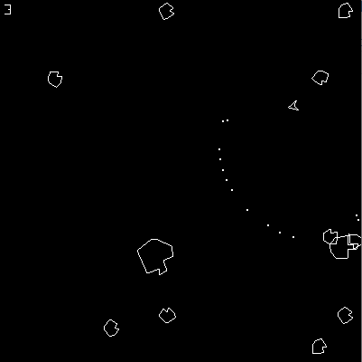
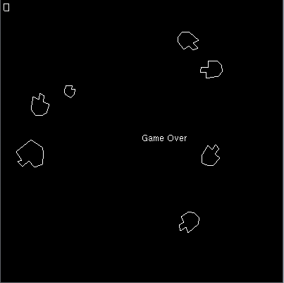
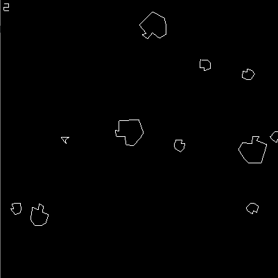

# Asteroids
Object-oriented program that allows a user to fly a spaceship around and shoot/avoid asteroids with a total of three lives.
The game includes the following functionality:
* Ship flies as if out in space with continued motion in the direction of thrust
* Bullets are fired from the tip of the ship
* Larger asteroids explode into two medium and one small asteroid
* Medium asteroids explode into two small asteroids 
* All objects wrap on to the opposite screen when they leave the screen
* The ship has three lives with an accompanying respond time after each death where
the ship blinks to let the user know that they have some time to get out of the way
of incoming asteroids 
* Game over when the lives count reaches zero

### Asteroids Game in Action

